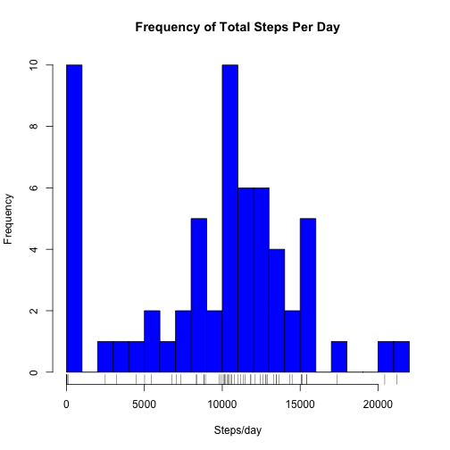
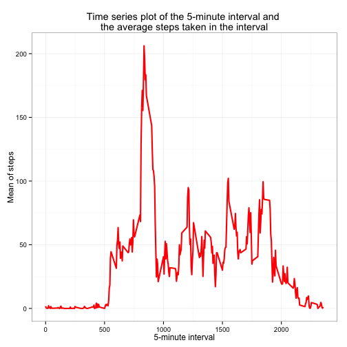
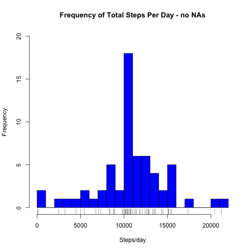
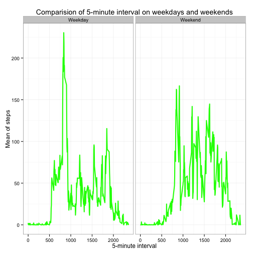

Reproducible Research - Assignment 1
========================================================

### Load required packages

```r
library(dplyr)
```

```
## 
## Attaching package: 'dplyr'
## 
## The following object is masked from 'package:stats':
## 
##     filter
## 
## The following objects are masked from 'package:base':
## 
##     intersect, setdiff, setequal, union
```

```r
library(ggplot2)
library(lattice)
```

### Load Dataset 
The dataset should be available in the working directory

```r
path <- file.path(getwd(),"activity.csv")
activity <- read.csv(path)
```

### Checking Data
Get an overview of the data

```r
str(activity)
```

```
## 'data.frame':	17568 obs. of  3 variables:
##  $ steps   : int  NA NA NA NA NA NA NA NA NA NA ...
##  $ date    : Factor w/ 61 levels "2012-10-01","2012-10-02",..: 1 1 1 1 1 1 1 1 1 1 ...
##  $ interval: int  0 5 10 15 20 25 30 35 40 45 ...
```

```r
names(activity)
```

```
## [1] "steps"    "date"     "interval"
```

```r
head(activity, 20)
```

```
##    steps       date interval
## 1     NA 2012-10-01        0
## 2     NA 2012-10-01        5
## 3     NA 2012-10-01       10
## 4     NA 2012-10-01       15
## 5     NA 2012-10-01       20
## 6     NA 2012-10-01       25
## 7     NA 2012-10-01       30
## 8     NA 2012-10-01       35
## 9     NA 2012-10-01       40
## 10    NA 2012-10-01       45
## 11    NA 2012-10-01       50
## 12    NA 2012-10-01       55
## 13    NA 2012-10-01      100
## 14    NA 2012-10-01      105
## 15    NA 2012-10-01      110
## 16    NA 2012-10-01      115
## 17    NA 2012-10-01      120
## 18    NA 2012-10-01      125
## 19    NA 2012-10-01      130
## 20    NA 2012-10-01      135
```

```r
tail(activity, 20)
```

```
##       steps       date interval
## 17549    NA 2012-11-30     2220
## 17550    NA 2012-11-30     2225
## 17551    NA 2012-11-30     2230
## 17552    NA 2012-11-30     2235
## 17553    NA 2012-11-30     2240
## 17554    NA 2012-11-30     2245
## 17555    NA 2012-11-30     2250
## 17556    NA 2012-11-30     2255
## 17557    NA 2012-11-30     2300
## 17558    NA 2012-11-30     2305
## 17559    NA 2012-11-30     2310
## 17560    NA 2012-11-30     2315
## 17561    NA 2012-11-30     2320
## 17562    NA 2012-11-30     2325
## 17563    NA 2012-11-30     2330
## 17564    NA 2012-11-30     2335
## 17565    NA 2012-11-30     2340
## 17566    NA 2012-11-30     2345
## 17567    NA 2012-11-30     2350
## 17568    NA 2012-11-30     2355
```

# What is the mean of total number of steps taken per day?
### Manipulating the data
Calculate sum, mean and median for each day

```r
activity_1 <- activity %>% group_by(date) %>% 
        summarise(sum_day = sum(steps, na.rm=TRUE),
                  mean_day = mean(steps, na.rm=TRUE),
                  median_day = median(steps, na.rm=TRUE))
```

### Histogram of total number of steps taken each day

```r
hist(activity_1$sum_day, col="blue", breaks=20, 
     main="Frequency of Total Steps Per Day", xlab="Steps/day")
rug(activity_1$sum_day)
```

 
### Report of mean and median of the total number of steps taken each day

```r
print(tbl_df(activity_1[,3:4]), n=61)
```

```
## Source: local data frame [61 x 2]
## 
##      mean_day median_day
## 1         NaN         NA
## 2   0.4375000          0
## 3  39.4166667          0
## 4  42.0694444          0
## 5  46.1597222          0
## 6  53.5416667          0
## 7  38.2465278          0
## 8         NaN         NA
## 9  44.4826389          0
## 10 34.3750000          0
## 11 35.7777778          0
## 12 60.3541667          0
## 13 43.1458333          0
## 14 52.4236111          0
## 15 35.2048611          0
## 16 52.3750000          0
## 17 46.7083333          0
## 18 34.9166667          0
## 19 41.0729167          0
## 20 36.0937500          0
## 21 30.6284722          0
## 22 46.7361111          0
## 23 30.9652778          0
## 24 29.0104167          0
## 25  8.6527778          0
## 26 23.5347222          0
## 27 35.1354167          0
## 28 39.7847222          0
## 29 17.4236111          0
## 30 34.0937500          0
## 31 53.5208333          0
## 32        NaN         NA
## 33 36.8055556          0
## 34 36.7048611          0
## 35        NaN         NA
## 36 36.2465278          0
## 37 28.9375000          0
## 38 44.7326389          0
## 39 11.1770833          0
## 40        NaN         NA
## 41        NaN         NA
## 42 43.7777778          0
## 43 37.3784722          0
## 44 25.4722222          0
## 45        NaN         NA
## 46  0.1423611          0
## 47 18.8923611          0
## 48 49.7881944          0
## 49 52.4652778          0
## 50 30.6979167          0
## 51 15.5277778          0
## 52 44.3993056          0
## 53 70.9270833          0
## 54 73.5902778          0
## 55 50.2708333          0
## 56 41.0902778          0
## 57 38.7569444          0
## 58 47.3819444          0
## 59 35.3576389          0
## 60 24.4687500          0
## 61        NaN         NA
```

# What is the average daily pattern?
### Manipulating the data
Calculate the mean of the intervals

```r
activity_2 <- activity %>% group_by(interval) %>%
        summarise(mean_int = mean(steps, na.rm=TRUE))
```
### Show the maximum mean at the interval

```r
filter(activity_2, mean_int == max(mean_int))
```

```
## Source: local data frame [1 x 2]
## 
##   interval mean_int
## 1      835 206.1698
```

### Creating the time series plot

```r
p <- ggplot(data=activity_2, aes(x=interval, y=mean_int))
p <- p + geom_line(size=1, color="red")
p <- p + theme_bw()
p <- p + ggtitle("Time series plot of the 5-minute interval and \nthe average steps taken in the interval")
p <- p + xlab("5-minute interval")
p <- p + ylab("Mean of steps")
p
```

 

# Input missing values 

### Calculate the total number of rows with NAs

```r
activity_complete <- complete.cases(activity)
activity_3 <- activity[activity_complete,]
nrow(activity)-nrow(activity_3)
```

```
## [1] 2304
```

### Strategy for filling missing values
Create a new file

```r
activity_4 <- activity
```

I decided to calculate the mean of interval for the missing values

```r
for(i in 1:nrow(activity_4)){
        if(is.na(activity_4[i,1])){
                activity_4[i,1] <- activity_4 %>% 
                        filter(interval == activity_4[i,3]) %>%
                        summarise(mean(steps, na.rm=TRUE))}}
```

### Calculation sum, mean and median - no NAs

```r
activity_5 <- activity_4 %>% group_by(date) %>% 
        summarise(sum_day = sum(steps, na.rm=TRUE),
                  mean_day = mean(steps, na.rm=TRUE),
                  median_day = median(steps, na.rm=TRUE))
```

### Histogram of total number of steps taken each day - no NAs

```r
hist(activity_5$sum_day, col="blue", breaks=20,
     main="Frequency of Total Steps Per Day - no NAs", xlab="Steps/day",
     ylim=c(0,20))
rug(activity_5$sum_day)
```

 

Just to show the difference between the two vectors (steps)

```r
activity_5$sum_day - activity_1$sum_day
```

```
##  [1] 10766.19     0.00     0.00     0.00     0.00     0.00     0.00
##  [8] 10766.19     0.00     0.00     0.00     0.00     0.00     0.00
## [15]     0.00     0.00     0.00     0.00     0.00     0.00     0.00
## [22]     0.00     0.00     0.00     0.00     0.00     0.00     0.00
## [29]     0.00     0.00     0.00 10766.19     0.00     0.00 10766.19
## [36]     0.00     0.00     0.00     0.00 10766.19 10766.19     0.00
## [43]     0.00     0.00 10766.19     0.00     0.00     0.00     0.00
## [50]     0.00     0.00     0.00     0.00     0.00     0.00     0.00
## [57]     0.00     0.00     0.00     0.00 10766.19
```
There is an increase of frequency (8) by 10766.19

# Are there differences in activity patterns between weekdays and weekends?
Work with the new dataset (no NAs)

```r
activity_6 <- activity_4
```

### Convert date from factor to Date

```r
activity_6$date <- as.Date(activity_6$date)
```

### Generate a new factor variable
Please note that I come from germany and use the german words for saturday (Samstag) and sunday (Sonntag)

```r
activity_6$daytype <-as.factor(ifelse(weekdays(activity_6$date) == "Samstag" |
                                    weekdays(activity_6$date) == "Sonntag",
                            "Weekend", "Weekday"))
```

### Manipulating the data
Calculate the mean of the interval for each day (with the new dataset)

```r
activity_7 <- activity_6 %>% group_by(interval, daytype) %>%
        summarise(sum_day=mean(steps))
```

### Create a panel plot 

```r
p <- ggplot(data = activity_7, aes(x=interval,y=sum_day, group=daytype))
p <- p + geom_line(size=1,color="green")
p <- p + theme_bw()
p <- p + facet_grid(. ~ daytype,scales="free_y")
p <- p + ggtitle("Comparision of 5-minute interval on weekdays and weekends")
p <- p + xlab("5-minute interval")
p <- p + ylab("Mean of steps")
p
```

 

As can be seen in the panel plot the average amount of steps rises faster during
weekdays \n(~interval 500) and higher (~ interval between 500 and 1000) than on
weekends. On weekends the average amount of steps rises more gradually
(~ interval 500 - 1000).
